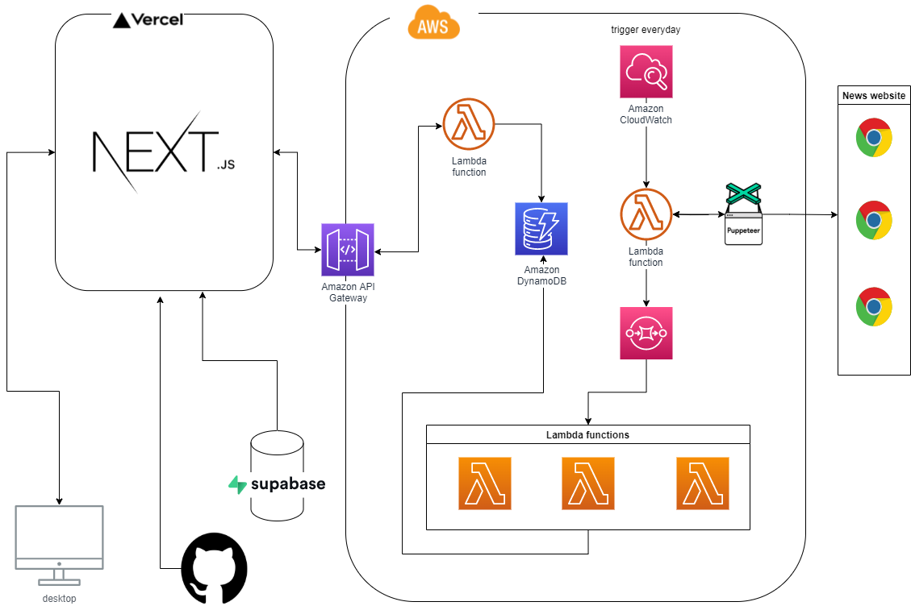

# ScrapppNoteee - SNS like News Comparing app inspired by scrapbook

An app based on multiple real world news resources created with  
Next.js, Supabase.io and AWS

> Live demo [_here_](https://scrap-note.vercel.app/).

## Table of Contents

- [General Info](#general-information)
- [Architecture](#architecture)
- [Technologies Used](#technologies-used)
- [Features](#features)
- [GIF](#gif)
- [Setup](#setup)
- [Project Status](#project-status)
- [Room for Improvement](#room-for-improvement)
<!-- * [License](#license) -->

## General Information

- User can compare several news published by news company in japan which updated everyday, and be able to store news in your scrapbook
- User can post article by using WYSIWYG editor
- Basic CRUD function
- Information is overloaded these days. Though, picking a right tool to update your information is so crucial. To make you choose a right resouce to get information, I decide to make this app which could make user to compare each news resource. Also, user could know what other user saved and read. I hope anyone could get an good quality news by using this app.

## Architecture

## Technologies Used

- Next.js - version 12.0.3
- SASS - version 1.42.4
- storybook - version 6.3.12
- supabase - 1.22.6
- TypeScript - 4.4.4

## Features

- User can compare newswebsite side by side which update everyday
- User can save news title and link after logged in
- User can read news title which other user saved
- User can write a blog by using react simple mde editor

## GIF

- Overview

  

- Saving, viewing, and adding to scrap book

  

## Project Status

Project is in progress...

## Room for Improvement

Room for improvement:

- editor which easy to use

To do:

- UI design for smartphone
- improve react-mde-editor to more user friendly editor

<!-- Optional -->
<!-- ## License -->
<!-- This project is open source and available under the [... License](). -->

<!-- You don't have to include all sections - just the one's relevant to your project -->
